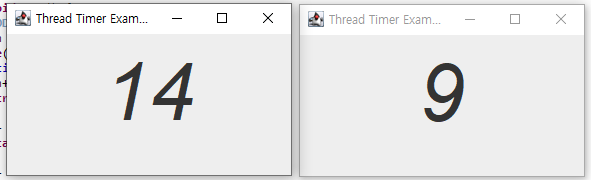

# Thread

## ⌚ 학습 기간

2022.12.27

## Thread

운영 체제는 두 가지 이상의 작업을 동시에 처리하는 멀티 태스킹을 할 수 있도록 CPU 및 메모리를  프로세스마다 적절히 할당해 주고, 병렬로 실행시킨다. 

하나의 스레드는 하나의 코드를 실행하는 흐름으로, 한 프로세스 내에 스레드가 2개라면 2개의 실행 흐름을 의미하게 된다. 

멀티 프로세스는 운영체제에서 할당 받은 메모리르 가지고 실행하여 각 프로세스는 독립적이고, 이는 다른 프로세스에 영향을 미치지 않는다. 

### 타이머 제작



```java
package Example.Thread;

import java.awt.Container;
import java.awt.FlowLayout;
import java.awt.Font;

import javax.swing.JFrame;
import javax.swing.JLabel;

class TimerThread extends Thread{
	private JLabel timerLabel;
	public TimerThread(JLabel timerLabel) {
		this.timerLabel = timerLabel;
	}
	@Override
	public void run() {
		// TODO Auto-generated method stub
		int n = 0;
		while(true) {
			timerLabel.setText(Integer.toString(n));
			n++;
			try {
				Thread.sleep(1000);
			}
			catch(InterruptedException e) {
				return;
			}
		}
	}
	
}
@SuppressWarnings("serial")
class ThreadTimerEx extends JFrame{
	public ThreadTimerEx() {
		setTitle("Thread Timer Example");
		setDefaultCloseOperation(JFrame.EXIT_ON_CLOSE);
		Container c = getContentPane();
		c.setLayout(new FlowLayout());
		
		JLabel timerLabel = new JLabel();
		timerLabel.setFont(new Font("Gothic", Font.ITALIC,80));
		c.add(timerLabel);
		
		TimerThread  th = new TimerThread(timerLabel);
		
		setSize(300,180);
		setVisible(true);
		th.start();
		
	}
}
public class Timer {

	public static void main(String[] args) {
		// TODO Auto-generated method stub
		new ThreadTimerEx();
	}
	

}
```

### 스레드의 상태

스레드는 다음 6가지의 상태를 가진다.

New, Runnable, Waiting, Timed_Waiting,Block,Terminated


interrupt() : InterruptedException을 발생시킨다. (강제종료)

sleep(long millis) : 스레드를 일시정지상태로 만듭니다. 

```java
JButton killbtn = new JButton("kill");
		c.add(killbtn);
		killbtn.addActionListener(e->{
			th.interrupt();
			killbtn.setEnabled(false);
		});
```

### 스레드 동기화 (Synchronization)

스레드 동기화는 공유 데이터를 동시에 다수의 스레드가 접근할 수 있게 하기 위한 것으로 , 동기화 핵심은 스레드의 공유 데이터에 대한 배타적 독점 접근 보장 이다. 

synchronized 키워드를 통하여 사용이 가능하다.

```java
synchronized public void add() {
		int n = sum;
		Thread.yield(); 
		n += 10; 
		sum = n; 
		System.out.println(Thread.currentThread().getName() + " : " + sum);
	}
```